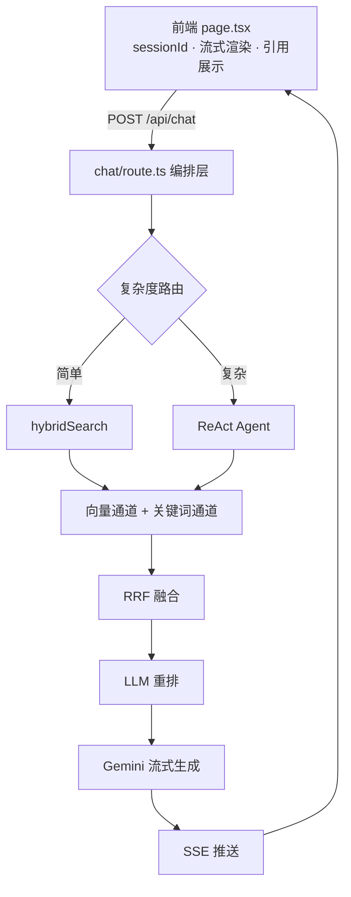

<div align="center">

# 🦥 懒大王知识库问答系统

**基于 Next.js + Supabase + pgvector 的 RAG + Agent 知识库问答系统**

[](https://nextjs.org/)
[](https://supabase.com/)
[](https://ai.google.dev/)
[](https://vercel.com/)

[🚀 在线体验](https://knowledge-baseai-eight.vercel.app/)

</div>

---

## ✨ 特性

- 🔍 **混合检索**：向量 + 关键词 → RRF 融合，交叉验证
- 🧠 **LLM 重排**：20 个候选 → 精选 Top 3
- ✍️ **查询改写**：多轮对话中指代消解
- 🧭 **复杂度路由**：简单问题走单跳，复杂问题走 ReAct
- 🤖 **ReAct Agent**：LLM 自主决定查什么、查几次
- ⚡ **流式输出**：SSE + 逐 token 推送
- 💾 **对话持久化**：匿名 session + 数据库，刷新不丢
- 📚 **引用来源**：每条回答绑定 sources，可展开查看

---

## 🏗️ 架构



---

## 🧰 技术栈

| 层 | 技术 |
|----|------|
| 框架 | Next.js (App Router) |
| 数据库 | Supabase (PostgreSQL + pgvector) |
| 向量 | 768 维 (Gemini text-embedding-004) |
| LLM | Gemini 2.0 Flash |
| 分词 | @node-rs/jieba v2 |
| 前端 | React 19 + Tailwind + react-markdown |

---

## 📦 模块清单

<details>
<summary><b>数据处理层</b></summary>

- **文件解析**：`lib/parsers/index.ts` — 完成 PDF / DOCX / MD / TXT
- **智能分块**：`lib/chunking/smart-chunker.ts` — 标题感知 + 表格 / 代码块保护
- **中文关键词**：`lib/services/keyword-extractor.ts` — jieba v2
- **文档处理**：`lib/services/document-service.ts` — 解析 → 分块 → embedding → 入库
- **向量化**：`lib/services/embedding-service.ts` — 单条 + 批量

</details>

<details>
<summary><b>检索层</b></summary>

- **向量检索**：`lib/services/vector-service.ts` — pgvector
- **关键词检索**：`lib/services/keyword-search.ts` — ILIKE + hit_count
- **混合检索 + RRF**：`lib/services/hybrid-service.ts` — 双通道融合
- **LLM 重排**：`lib/services/reranker.ts` — 1-based + JSON 解析

</details>

<details>
<summary><b>查询理解层</b></summary>

- **查询改写**：`lib/services/query-rewriter.ts` — 指代消解
- **复杂度路由**：`lib/services/router.ts` — 规则匹配
- **多查询拆解**：`lib/services/planner.ts` — 并行检索 + 去重

</details>

<details>
<summary><b>Agent 层</b></summary>

- **ReAct 循环**：`lib/services/react-agent.ts` — function calling
- **单跳流水线**：`hybridSearch` + `rerank` — 被工具复用
- **对话持久化**：`chat_messages` 表 — 匿名 session

</details>

<details>
<summary><b>会话层</b></summary>

- **问答接口**：`app/api/chat/route.ts`
- **历史加载**：`app/api/chat/history/route.ts`
- **流式生成**：`lib/services/chat-service.ts` — 超时保护
- **前端**：`app/page.tsx` — sessionId 持久化

</details>

<details>
<summary><b>工程化</b></summary>

- `server-only` 隔离 — 保护密钥
- API key 启动检查
- `stripPrefix` 工具
- CONFIG 开关 — `ENABLE_REACT`
- 超时保护 — `Promise.race`

</details>

---

## 🗄️ 数据库

<details>
<summary><b>表结构 / 存储过程 / 索引</b></summary>

```text
documents
├── id (uuid)
├── title
├── file_type
├── file_size
├── file_path
├── chunk_count
├── status
└── created_at

document_chunks
├── id (uuid)
├── document_id
├── raw_content          # 原文
├── content              # 带【章节路径】前缀
├── title_path           # "公司制度 > 报销流程"
├── chunk_index
├── char_count
├── metadata
├── embedding (768维)
├── token_count
└── created_at

chat_messages
├── id
├── session_id
├── role (user / assistant)
├── content
├── sources_json
└── created_at
```

**存储过程**

- `match_document_chunks` — 向量通道
- `search_chunks_by_keywords` — 关键词通道

**索引**

- `document_chunks_pkey`
- `idx_document_chunks_doc_chunk` (`document_id`, `chunk_index`)
- `idx_document_chunks_metadata`
- `idx_chat_messages_session`

</details>

---

## 🚧 暂未实现 / 理性取舍

<details>
<summary><b>展开查看</b></summary>

- **RAGAS 评估**：库不匹配，自己写太麻烦，先用起来再说
- **GraphRAG**：数据量不够，1-2 周投入不划算
- **Self-RAG**：prompt 已有防幻觉约束，没感知到幻觉问题
- **认证系统**：匿名 session 够用，不需要注册登录
- **CRAG 质量门控**：复杂度高，收益待验证
- **CONFIG 开关全面化**：只做了 `ENABLE_REACT`

</details>

---

## 🚀 部署

- 在线体验：https://knowledge-baseai-eight.vercel.app/
- 部署平台：Vercel
- 数据库：Supabase
- 向量扩展：pgvector

---

<div align="center">

最后更新：2026-09-18

</div>